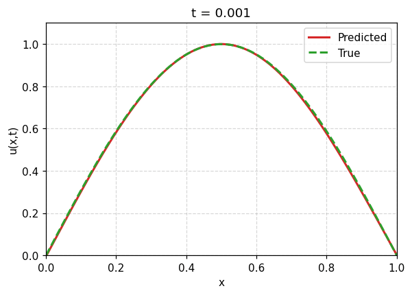

# 1D Heat Equation Solver with CNN Forecasting


This project implements a numerical solver for the 1D heat equation using the explicit Euler method and develops two machine learning approaches to learn the dynamics:
- A 1D Convolutional Neural Network (CNN) that predicts the time evolution of the field `u(x, t)`.
- A Physics-Informed Neural Network (PINN) that embeds the governing PDE directly into the training process.

We are currently extending this framework to generalize across different diffusion coefficients D

## 🔬 Problem Overview

We solve the 1D diffusion equation:

```
∂u/∂t = D ∂²u/∂x²
```

- Discretized using finite differences and evolved using the explicit Euler scheme.
- The model learns to map `u(x)^n` to `u(x)^{n+1}` using a CNN.
- The PINN model is trained to satisfy the PDE using randomly sampled collocation points, initial, and boundary conditions.
- Future versions will support diffusion coefficient variation during training and inference.

## 🛠️ Project Structure

```
.
├── data/                   # Generated .csv and/or .npz data files
├── src/
│   ├── solver.py           # Numerical PDE solver using Euler scheme
│   ├── model.py            # CNN model definition
│   ├── data_generator.py   # Data loader and preprocessor
│   └── train.py            # Training pipeline
├── notebooks/
│   └── heat_eq.ipynb     # Notebook for training, predictions and plotting
├── README.md
```

## 📦 Dependencies

- Python 3.10+
- TensorFlow 2.x
- NumPy
- Pandas
- Matplotlib
- scikit-learn

Install with:

```bash
pip install -r requirements.txt
```

## 🚀 Usage

### 1. Generate Data

```bash
python src/solver.py
```

This generates training data using a 1D finite-difference solver.

### 2. Train the Model
 In the jupyter notebook

### 3. Make Predictions

Use the trained model to predict the next time step and compare with the true PDE solution. See `notebooks/visualize.ipynb` for examples.

## 📈 Sample Output



> PINN-predicted solution vs ground truth over time.


## 📌 Notes

- The model is trained for a fixed diffusion coefficient.
- Next generalize it to different diffusion coefficients.
- Currently supports 1D; extension to 2D is under development.
- Designed to test whether CNNs can learn time evolution dynamics from PDEs.